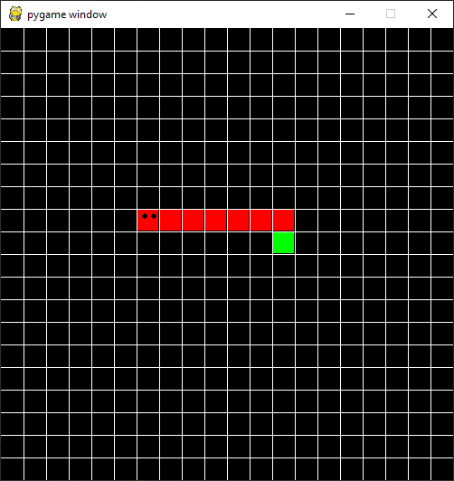

This is a python game built using a tutorial from a YouTube video [Learn Python by Building Five Games - Full Course](https://www.youtube.com/watch?v=XGf2GcyHPhc)

I also added a little bit to it since I wanted additional customizations (moving the classes to their own files and updating variable names to make more since to me).

    

